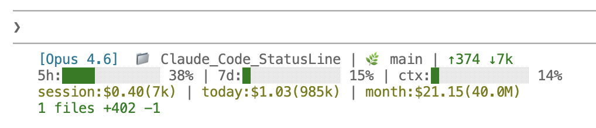

# Claude Code StatusLine

[English](./README.md)

为 [Claude Code](https://docs.anthropic.com/en/docs/claude-code) 打造的自定义状态栏，实时显示模型信息、Token 用量、速率限制、费用统计和 Git 状态。



## 功能特性

- **模型信息** — 当前模型名称（Opus 4.7 / 4.6、Sonnet 4.6、Haiku 4.5）及 effort 等级（xHigh / High / Medium / Low）
- **Token 用量** — 输入/输出 Token 数，自动格式化（k / M）
- **速率限制** — 5 小时和 7 天用量，可视化进度条 + 重置倒计时
- **上下文窗口** — 上下文已使用百分比
- **费用统计** — 会话/今日/本月费用，基于 [ccusage](https://github.com/ryoppippi/ccusage)
- **Git 状态** — 当前分支、变更文件数、增删行数
- **跨平台** — Bash 版本（macOS/Linux）+ Node.js 版本（全平台含 Windows）

## 快速开始

### 方式 A：Bash（macOS / Linux）

```bash
bash <(curl -sL https://raw.githubusercontent.com/Muyiiiii/Claude_Code_StatusLine/main/install-statusline.sh)
```

或克隆后运行：

```bash
git clone https://github.com/Muyiiiii/Claude_Code_StatusLine.git
cd Claude_Code_StatusLine
bash install-statusline.sh
```

**依赖：** `git`、`jq`、`bun` 或 `npx`

### 方式 B：Node.js（macOS / Linux / Windows）

```bash
npx claude-code-statusline
```

或克隆后运行：

```bash
git clone https://github.com/Muyiiiii/Claude_Code_StatusLine.git
cd Claude_Code_StatusLine
node bin/install.js
```

**依赖：** `git`、`node`（v14+）、`bun` 或 `npx`（可选，用于 ccusage 费用统计）

## 安装原理

安装器执行两个步骤：

1. **复制状态栏脚本** 到 `~/.claude/statusline.sh`（Bash）或 `~/.claude/statusline.js`（Node.js）
2. **配置 `~/.claude/settings.json`**：

```json
{
  "statusLine": {
    "type": "command",
    "command": "~/.claude/statusline.sh",
    "padding": 1
  }
}
```

安装完成后，重启 Claude Code 即可看到新状态栏。

## 显示布局

```
[Opus 4.7·xHigh]  📁 my-project | 🌿 main | ↑125k ↓9k
5h:█░░░░░░░ 12% (2h15m) | 7d:░░░░░░░░ 3% (6d2h) | ctx:██░░░░░░ 35%
session:$0.42(134k) | today:$3.21(1.2M) | month:$28.50(15.6M)
3 files +156 -23
```

| 行 | 内容 |
|----|------|
| 1 | 模型名称 + effort、项目目录、Git 分支、输入/输出 Token |
| 2 | 5 小时 / 7 天速率限制进度条（含重置倒计时）、上下文使用率 |
| 3 | 会话 / 今日 / 本月费用和 Token 总量 |
| 4 | Git 变更文件数、增删行数 |

Effort 等级从 `~/.claude/settings.json` 的 `effortLevel` 字段读取（由 Claude Code 的 `/model` 菜单设置）。

## 费用统计

月度和每日费用数据通过 [ccusage](https://github.com/ryoppippi/ccusage) 在后台异步获取。缓存文件位于 `/tmp/ccusage_cache/daily.json`（Windows 上为 `%TEMP%\ccusage_cache\daily.json`），每 5 分钟刷新一次。

如果 `ccusage` 不可用或无数据，费用字段将显示 `$0.00`。

## 卸载

删除状态栏脚本：

```bash
rm -f ~/.claude/statusline.sh ~/.claude/statusline.js
```

然后从 `~/.claude/settings.json` 中移除 `"statusLine"` 字段，如果文件中只有该字段则可直接删除文件。

## 项目结构

```
├── install-statusline.sh   # Bash 安装器（macOS / Linux）
├── bin/
│   ├── install.js          # Node.js 跨平台安装器
│   └── statusline.js       # Node.js 状态栏脚本
├── package.json            # npm 包配置
├── README.md               # 英文文档
└── README_CN.md            # 中文文档
```

## 许可证

MIT
