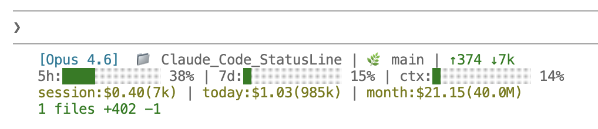

# muyi_code_statusline

[English](./README.md)

为 [Claude Code](https://code.claude.com/docs/en/statusline) 打造的自定义状态栏，实时显示模型信息、Token 用量、速率限制、费用统计和 Git 状态。



## 功能特性

- **模型信息** — 当前 Claude 模型（Fable 5、Opus 4.8、Sonnet 5、Haiku 4.5 等）及 effort 等级（Max / xHigh / High / Medium / Low）
- **Token 用量** — 输入/输出 Token 数，自动格式化（k / M）
- **速率限制** — 5 小时和 7 天用量，可视化进度条 + 重置倒计时
- **上下文窗口** — 上下文已使用百分比
- **费用统计** — 会话/今日/本月费用，基于 [ccusage](https://github.com/ccusage/ccusage)
- **Git 状态** — 当前分支、变更文件数、增删行数
- **跨平台** — 提供 Bash 和 PowerShell 一行安装，以及适用于全平台的 Node.js 安装器

## 快速开始

### macOS / Linux（Bash）

```bash
bash <(curl -fsSL https://raw.githubusercontent.com/Muyiiiii/muyi_code_statusline/main/install-statusline.sh)
```

或克隆后运行：

```bash
git clone https://github.com/Muyiiiii/muyi_code_statusline.git
cd muyi_code_statusline
bash install-statusline.sh
```

**依赖：** `git`、`jq`、`bun` 或 `npx`

### Windows（PowerShell）

在 PowerShell 中运行：

```powershell
powershell.exe -NoProfile -Command "[Net.ServicePointManager]::SecurityProtocol = [Net.ServicePointManager]::SecurityProtocol -bor [Net.SecurityProtocolType]::Tls12; Invoke-RestMethod 'https://raw.githubusercontent.com/Muyiiiii/muyi_code_statusline/main/install-statusline.ps1' | Invoke-Expression"
```

该命令会在独立的 PowerShell 进程中启用 TLS 1.2，以兼容 Windows PowerShell 5.1。引导脚本会把 `bin/install.js` 和 `bin/statusline.js` 下载到独立的临时目录，校验并运行 Node.js 安装器，完成后自动删除临时文件；项目本身不通过 npm 安装。

**依赖：** `node`（v18+）；`git` 为可选依赖，仅影响 Git 信息，`bun` 或 `npx` 为费用统计的可选依赖。

### 克隆运行（macOS / Linux / Windows）

```bash
git clone https://github.com/Muyiiiii/muyi_code_statusline.git
cd muyi_code_statusline
node bin/install.js
```

**依赖：** `node`（v18+）；`git` 为可选依赖，仅影响 Git 信息，`bun` 或 `npx` 为费用统计的可选依赖。

## 安装原理

安装器执行两个步骤：

1. **复制状态栏脚本** 到 `~/.claude/statusline.sh`（Bash）或 `~/.claude/statusline.js`（Node.js）
2. **配置 `~/.claude/settings.json`**：

Bash 版本：
```json
{
  "statusLine": {
    "type": "command",
    "command": "~/.claude/statusline.sh",
    "padding": 1
  }
}
```

Node.js 版本：
```json
{
  "statusLine": {
    "type": "command",
    "command": "'<Node.js 绝对路径>' '<用户目录>/.claude/statusline.js'",
    "padding": 1
  }
}
```

Node.js 安装器会为 Node.js 和状态栏脚本写入经过 shell 引用的绝对路径；实际值因平台和用户而异。

安装完成后，重启 Claude Code 即可看到新状态栏。

## 显示布局

```
[Fable 5·Max]  📁 my-project | 🌿 main | ↑125k ↓9k
5h:█░░░░░░░ 12% (2h15m) | 7d:░░░░░░░░ 3% (6d2h) | ctx:██░░░░░░ 35%
session:$0.42(134k) | today:$3.21(1.2M) | month:$28.50(15.6M)
3 files +156 -23
```

| 行 | 内容 |
|----|------|
| 1 | 模型名称 + effort、项目目录、Git 分支、输入/输出 Token |
| 2 | 5 小时 / 7 天速率限制进度条（含重置倒计时）、上下文使用率 |
| 3 | 会话 / 今日 / 本月费用和 Token 总量 |
| 4 | Git 变更文件数、增删行数 |

Effort 等级优先从状态栏输入读取，缺失时再读取 `~/.claude/settings.json` 的 `effortLevel` 字段（由 Claude Code 的 `/model` 菜单设置）。

## 当前 Claude 模型与 effort 支持

已知显示映射跟随当前 [Claude 模型列表](https://platform.claude.com/docs/en/about-claude/models/overview)，包括 Fable 5、Mythos 5 / Preview、Opus 4.8 / 4.7 / 4.6、Sonnet 5 / 4.6 和 Haiku 4.5。以后出现的新模型会回退使用 Claude Code 提供的 `model.display_name`，不会被错误标记。

按照当前 [Claude Code 模型配置](https://code.claude.com/docs/en/model-config)，可持久化的 `effortLevel` 为 `low`、`medium`、`high` 和 `xhigh`。会话级 `max` 会在 Claude Code 通过实时状态输入提供时显示。例如，下面的可选偏好可以与安装器管理的 `statusLine` 字段共存：

```json
{
  "model": "best",
  "effortLevel": "high"
}
```

安装器会保留这些偏好，只修改 `statusLine`。

## 费用统计

Claude 专属的月度和每日费用数据通过固定版本 `ccusage@20.0.17` 在后台异步获取，不会混入其他 agent 的用量。缓存位于系统临时目录下每位用户独立的 `muyi-code-statusline-*` 私有目录中，每 5 分钟刷新一次。

如果 `ccusage` 不可用或无数据，费用字段将显示 `$0.00`。

## 卸载

删除状态栏脚本：

```bash
rm -f ~/.claude/statusline.sh ~/.claude/statusline.js
```

Windows PowerShell：

```powershell
Remove-Item "$HOME\.claude\statusline.js" -Force -ErrorAction SilentlyContinue
```

然后从 `~/.claude/settings.json` 中移除 `"statusLine"` 字段，如果文件中只有该字段则可直接删除文件。

替换已有文件时，安装器会在相邻位置用 `.bak` 文件保留原配置和脚本。

## 项目结构

```
├── install-statusline.sh   # Bash 安装器（macOS / Linux）
├── install-statusline.ps1  # PowerShell 引导脚本（Windows）
├── bin/
│   ├── install.js          # Node.js 跨平台安装器
│   └── statusline.js       # Node.js 状态栏脚本
├── assets/                 # 效果预览图
├── test/                   # 隔离安装与运行时测试
├── LICENSE                 # MIT 许可证
├── package.json            # Node.js 项目配置
├── README.md               # 英文文档
└── README_CN.md            # 中文文档
```

## 许可证

[MIT](./LICENSE)
